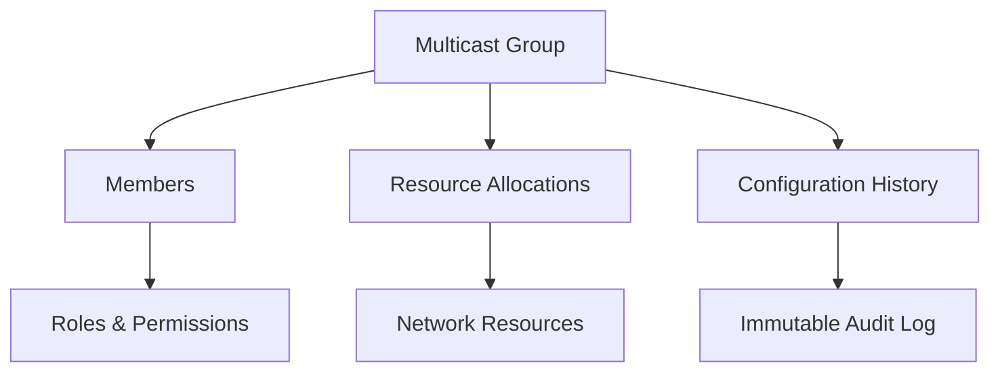

# MultiCast Local: Decentralized Local Network Management

A blockchain-powered smart contract system for managing and tracking local network multicast configurations and resources.

## Overview

MultiCast Local provides a secure, transparent, and decentralized approach to managing local network multicast settings. By leveraging blockchain technology, this system ensures:

- Immutable multicast group management
- Transparent network resource allocation
- Role-based access control
- Auditable network configuration changes
- Secure group membership tracking

## Key Features

- Create and manage multicast groups
- Define network resource permissions
- Track membership and access rights
- Log all network configuration changes
- Implement granular access controls

## Architecture



## Contract Documentation

### MultiCast Manager Contract

The core smart contract managing multicast group configurations and access controls.

#### Core Capabilities
- Multicast group creation and management
- Dynamic resource allocation
- Membership and role management
- Comprehensive activity logging

#### Role Hierarchy
1. Network Administrator
2. Group Manager
3. Member
4. Observer

## Getting Started

### Requirements
- Clarinet
- Stacks Blockchain Development Environment
- Basic understanding of network multicast concepts

### Installation

1. Clone the repository
2. Install dependencies
```bash
clarinet install
```
3. Run test suite
```bash
clarinet test
```

## Function Reference

### Project Management

```clarity
(create-project (title (string-utf8 100)) 
                (description (string-utf8 500))
                (start-date uint)
                (end-date uint)
                (budget uint))
```

```clarity
(update-project (project-id uint)
                (title (string-utf8 100))
                (description (string-utf8 500))
                (status uint)
                (start-date uint)
                (end-date uint)
                (budget uint))
```

### Task Management

```clarity
(create-task (project-id uint)
             (title (string-utf8 100))
             (description (string-utf8 500))
             (assignee (optional principal))
             (priority uint)
             (estimated-hours uint)
             (start-date uint)
             (due-date uint)
             (milestone-id (optional uint)))
```

```clarity
(update-task-status (project-id uint)
                    (task-id uint)
                    (new-status uint))
```

### Team Management

```clarity
(add-team-member (project-id uint)
                 (member principal)
                 (role uint))
```

```clarity
(update-team-member-role (project-id uint)
                        (member principal)
                        (new-role uint))
```

## Development

### Testing

Run the test suite:
```bash
clarinet test
```

### Local Development

1. Start local chain:
```bash
clarinet integrate
```

2. Deploy contracts:
```bash
clarinet deploy
```

## Security Considerations

1. Role-based access control
   - All sensitive operations require appropriate permissions
   - Owner role cannot be transferred or removed

2. Data Validation
   - All inputs are validated before processing
   - Status transitions are properly controlled

3. Dependency Management
   - Circular dependencies are prevented
   - Task dependencies must be completed before dependent tasks can start

4. State Management
   - Critical state changes are atomic
   - Activity logging provides audit trail

5. Known Limitations
   - No bulk operations supported
   - Cannot delete projects or tasks (only cancel)
   - File storage must be handled off-chain